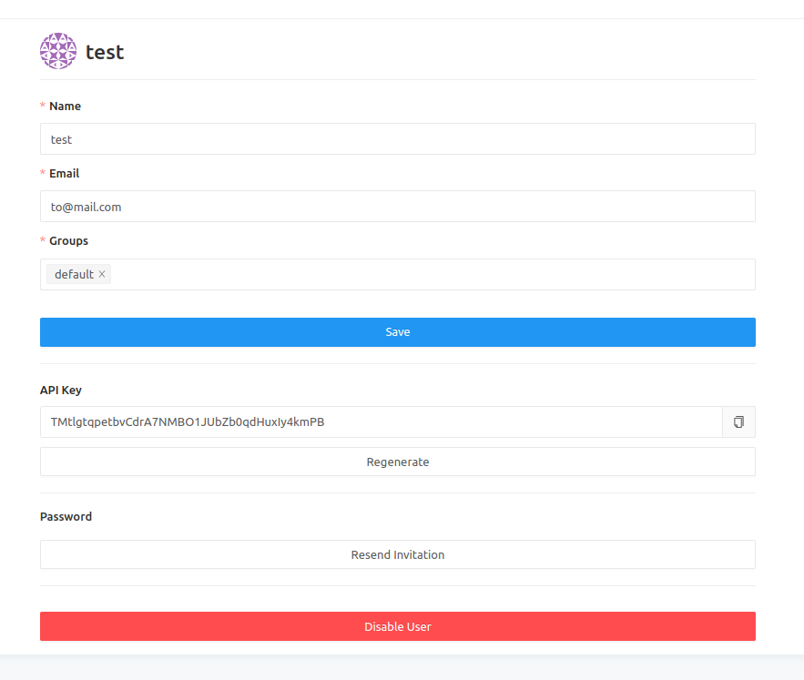
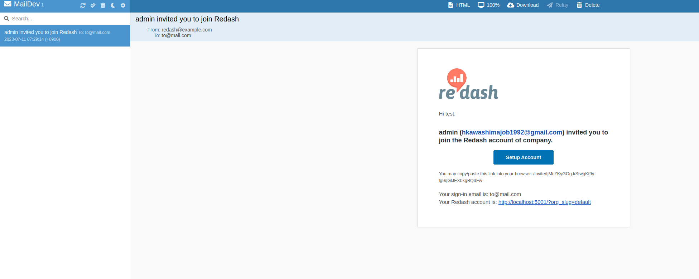

# redashのメール設定の検証

## 確認

``` bash
$ touch .env
```

.envに以下を追加

``` txt
REDASH_COOKIE_SECRET=hogehoge
REDASH_MAIL_SERVER=email
REDASH_MAIL_PORT=1025
```

```
$ docker-compose up
```

```
$ docker compose run --rm server create_db
```

```
$ yarn
$ yarn build
$ yarn start
```

` http://localhost:5000 ` にアクセスし、ユーザーを追加する



` http://localhost:80 ` にアクセスし、メールが届いていることを確認する



## 修正

docker-compose.ymlに誤りがあったので修正した

``` diff
diff --git a/docker-compose.yml b/docker-compose.yml
index 42444c048..12c2e0484 100644
--- a/docker-compose.yml
+++ b/docker-compose.yml
@@ -65,5 +65,5 @@ services:
   email:
     image: maildev/maildev
     ports:
-      - "1080:80"
+      - "80:1080"
     restart: unless-stopped
```

## ref

[公式ドキュメント](https://redash.io/help/open-source/dev-guide/docker)
